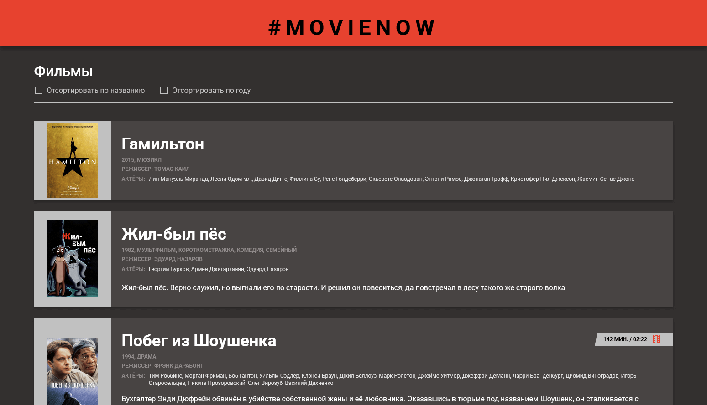

# Тестовое задание в Наткрекер

Проект создан с помощью [create-vue](https://github.com/vuejs/create-vue).

[Посмотреть вживую](https://ncracker.staskozin.ru/)

[](https://ncracker.staskozin.ru/)

## Команды

### Установка зависимостей

```sh
npm install
```

### Запуск в режиме разработки

```sh
npm run dev
```

### Сборка в продакшен

```sh
npm run build
```
